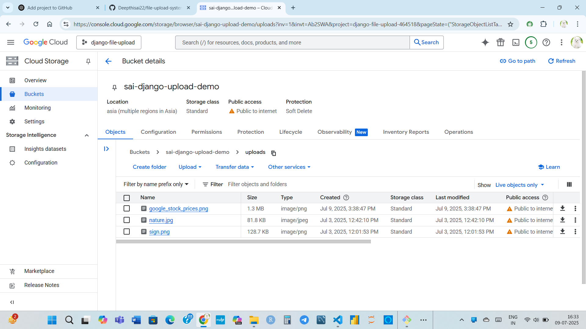

# 📁 Django File Upload System with Google Cloud Storage (GCS)

This project is a simple Django-based file upload system that stores files securely in **Google Cloud Storage (GCS)** instead of local storage. It demonstrates how to integrate cloud storage into Django apps for scalable file management.

---

## 🚀 Features

- Upload files through a web interface
- Store files directly in GCS bucket
- Secure file access via signed URLs or public URLs
- Clean and modular Django app structure
- Uses `django-storages` and `google-cloud-storage` libraries

---

## 🛠️ Tech Stack

- **Backend**: Django (Python)
- **Cloud Storage**: Google Cloud Storage (GCS)
- **Libraries**:
  - `django-storages`
  - `google-cloud-storage`

---

## ⚙️ Setup Instructions

### 1. 🔑 Create a GCS Bucket
- Go to [Google Cloud Console](https://console.cloud.google.com/)
- Create a new bucket
- Enable the **Storage API**
- Download the **service-account JSON key** and save it in your project root

---

### 2. 📦 Install Dependencies

```bash
# pip install -r requirements.txt

""" 3. 🛠️ Django Configuration

📂 Project Structure

file-upload-system/
├── file_upload_system/       # Django project settings
│   └── settings.py
├── upload/                   # Main app
│   ├── views.py
│   ├── models.py
│   ├── urls.py
│   └── forms.py
├── templates/                # HTML templates (optional)
├── service-account.json      # GCS credentials (ignored in Git)
├── requirements.txt
├── manage.py
├── .gitignore
└── README.md
---
## 📸 Screenshots

### 🔹 Google Cloud Storage – Bucket Overview


### 🔸 Google Cloud Storage – Uploaded Files



📄 License
This project is licensed for educational and personal use.

✍️ Author
Deepthi Sai
🔗 GitHub: @Deepthisai22

